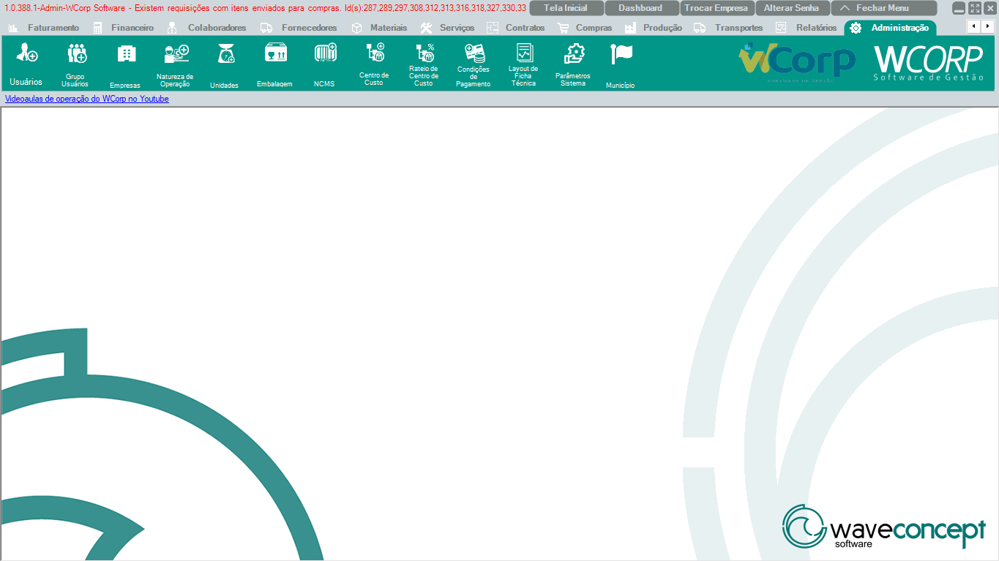

# Administração

A aba **Administração** reúne usuários, empresas, naturezas de operação, unidades, embalagens, NCMs, centros de custo, condições de pagamento e parâmetros do sistema.

A documentação desta seção segue a mesma ordem dos botões exibidos no WCorp.

## Ordem da aba Administração

| Ordem | Rotina | Página |
| --- | --- | --- |
| 1 | Usuários | [Acessar](usuarios.md) |
| 2 | Grupo Usuários | [Acessar](grupo-usuarios.md) |
| 3 | Empresas | [Acessar](empresas.md) |
| 4 | Natureza de Operação | [Acessar](natureza-op.md) |
| 5 | Unidades | [Acessar](unidades.md) |
| 6 | Embalagem | [Acessar](embalagem.md) |
| 7 | NCMS | [Acessar](ncms.md) |
| 8 | Centro de Custo | [Acessar](centro-custo.md) |
| 9 | Rateio de Centro de Custo | [Acessar](rateio-centro-custo.md) |
| 10 | Condições de Pagamento | [Acessar](condicoes-pagamento.md) |
| 11 | Layout de Ficha Técnica | [Acessar](layout-ficha-tecnica.md) |
| 12 | Parâmetros Sistema | [Acessar](parametros-sistema.md) |
| 13 | Município | [Acessar](municipio.md) |

## Antes de operar rotinas de Administração

- Altere configurações administrativas com atenção ao impacto em outras rotinas.`r`n- Confira permissões, empresa e regras fiscais antes de salvar.`r`n- Em parâmetros, registre a regra de negócio que motivou a alteração.

??? info "Ver mais para Suporte"

    ## Orientação para Suporte

    Em atendimentos de Administração, colete usuário, empresa, parâmetro ou cadastro alterado, mensagem completa e print da tela.
