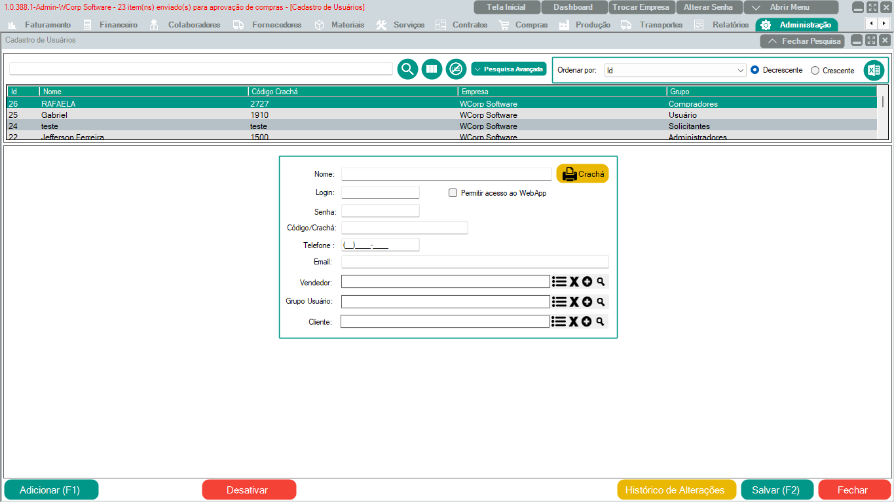

# Módulo Administração - Cadastro de Usuários

Para cadastrar um usuário é necessário preencher o Nome, Login, Senha e Grupo de Usuário.
O restante das opções fica a critério do usuário administrador.

!!! info "Dica"
    Se o usuário novo for atrelado a algum vendedor ou cliente somente selecionar algum vendedor ou cliente já cadastrado.
	
!!! warning "Importante"
    O cadastro do usuário sempre deve ser feito pelo usuário administrador ou mediante autorização de algum responsável
