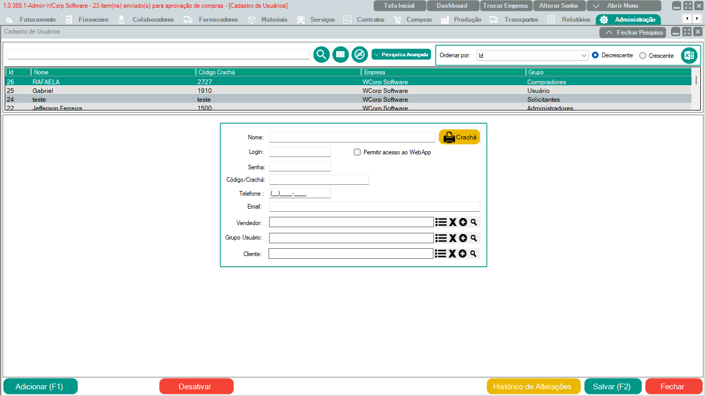

# Usuários

## Objetivo

Cadastrar e consultar usuários que acessam o WCorp.

## Quando usar

Use esta tela quando for necessário cadastrar, revisar ou ajustar o acesso de um usuário.

## Caminho

`Administração > Usuários`.

## Print da tela

## Campos principais

Para cadastrar um usuário é necessário preencher o Nome, Login, Senha e Grupo de Usuário.
O restante das opções fica a critério do usuário administrador.

## Avisos

!!! info "Dica"
    Se o usuário novo for atrelado a algum vendedor ou cliente somente selecionar algum vendedor ou cliente já cadastrado.
	
!!! caution "Cadastro autorizado"
    O cadastro do usuário sempre deve ser feito pelo usuário administrador ou mediante autorização de algum responsável
