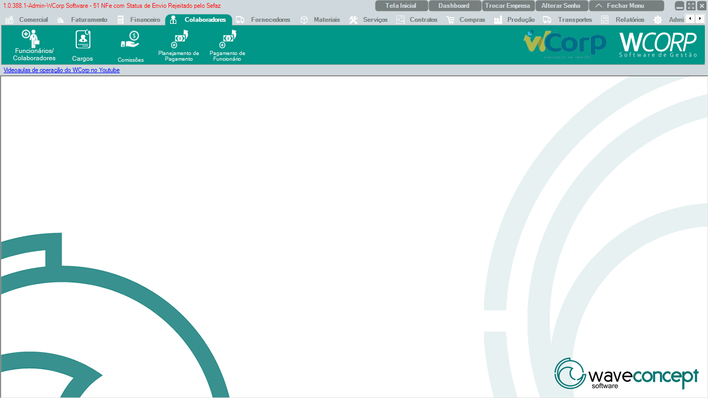

# Colaboradores

A aba **Colaboradores** reúne rotinas relacionadas a funcionários, cargos, comissões, planejamento de pagamento e pagamento de funcionário.

A documentação desta seção segue a mesma ordem dos botões exibidos no WCorp.

## Ordem da aba Colaboradores

| Ordem | Rotina | Página |
| --- | --- | --- |
| 1 | Funcionários / Colaboradores | [Acessar](funcionarios-colaboradores.md) |
| 2 | Cargos | [Acessar](cargos.md) |
| 3 | Comissões | [Acessar](comissoes.md) |
| 4 | Planejamento de Pagamento | [Acessar](planejamento-pagamento.md) |
| 5 | Pagamento de Funcionário | [Acessar](pagamento-funcionario.md) |

## Antes de operar rotinas de colaboradores

- Confira se o colaborador está cadastrado corretamente.
- Verifique cargo, vínculo, situação e dados financeiros quando aplicável.
- Em pagamentos, valide período, valores e status antes de confirmar.
