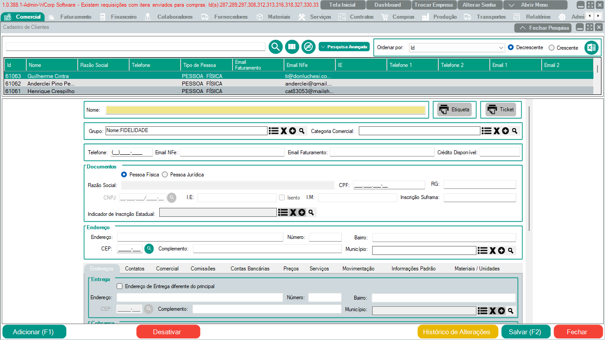

# Clientes

## Objetivo

Cadastrar e consultar clientes no WCorp para uso em pedidos, orçamentos, faturamento e demais funcionalidades.

## Quando usar

Use esta rotina quando for necessário:

- Cadastrar um novo cliente.
- Consultar ou revisar dados de um cliente existente.
- Completar informações antes de lançar orçamento, pedido ou nota fiscal.
- Corrigir dados cadastrais que estejam impedindo uma operação comercial ou fiscal.

## Caminho no WCorp

`Comercial > Clientes`

## Vídeo de referência

O trecho de **1:20 até 2:00** mostra o acesso e o cadastro de cliente pela aba Comercial.

[Assistir no YouTube a partir de 1:20](https://www.youtube.com/watch?v=osiFPSfEOrc&list=PLouJpYsMKL1fizkcacjs-UdhTCnxnrMOO&t=80s)

## Passo a passo

1. Acesse a aba **Comercial**.
2. Clique em **Clientes**.
3. Inicie um novo cadastro ou abra um cliente existente para edição.
4. Para preenchimento automático, informe o **CNPJ** e clique na **lupa**.
5. Confira os dados retornados pela consulta.
6. Preencha manualmente os campos que faltarem.
7. Clique em **Salvar**.

!!! info "Importante"
    Caso seja um CNPJ recém-cadastrado, a atualização na base da SEFAZ pode levar mais de 30 dias. Nesses casos, pode ser necessário preencher as informações manualmente.

## Campos principais

| Campo | Descrição | Observações |
| --- | --- | --- |
| CNPJ | Documento da empresa cliente | Pode ser usado com a lupa para buscar dados automaticamente |
| Razão social / Nome | Identificação principal do cliente | Conferir antes de salvar |
| Endereço | Dados de localização do cliente | Importante para faturamento e entrega |
| Contato | Telefone, e-mail ou responsável | Ajuda em atendimento e cobrança |
| Dados fiscais | Informações usadas no faturamento | Conferir quando houver emissão de nota |

## Dúvidas Frequentes

| Dúvida | Orientação |
| --- | --- |
| Posso cadastrar digitando só o CNPJ? | Informe o CNPJ e clique na lupa. Depois confira os dados e complete o que estiver faltando. |
| O CNPJ não retornou dados pela lupa. O que fazer? | Se for CNPJ recente, pode ainda não estar atualizado na base da SEFAZ. Preencha manualmente. |
| Preciso preencher todos os campos? | Preencha os campos obrigatórios e os dados necessários para a operação que será feita. |
| O cliente não aparece no pedido | Verifique se o cadastro foi salvo corretamente e se não há filtros ou bloqueios aplicados. |
