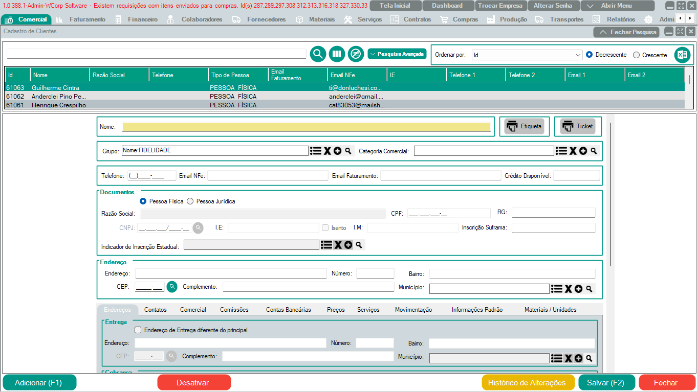

# Clientes

## Objetivo

Cadastrar e consultar clientes no WCorp para uso em pedidos, orçamentos, faturamento e demais funcionalidades.

## Caminho

<!-- TODO: adicionar Caminho -->

## Print da tela

## Quando usar

<!-- TODO: adicionar Quando usar -->

## Como usar

### Consulta

1. Acesse a aba **Comercial**.
2. Clique em **Clientes**.
3. Inicie um novo cadastro ou abra um cliente existente para edição.
4. Para preenchimento automático, informe o **CNPJ** e clique na **lupa**.
5. Confira os dados retornados pela consulta.
6. Preencha manualmente os campos que faltarem.
7. Clique em **Salvar**.

### Campos principais

| Campo | Descrição |
| --- | --- |
| CNPJ | Documento da empresa cliente. Pode ser usado com a lupa para buscar dados automaticamente. |
| Razão social / Nome | Identificação principal do cliente. Conferir antes de salvar. |
| Endereço | Dados de localização do cliente. Importante para faturamento e entrega. |
| Contato | Telefone, e-mail ou responsável. Ajuda em atendimento e cobrança. |
| Dados fiscais | Informações usadas no faturamento. Conferir quando houver emissão de nota. |

### Ações disponíveis

<!-- TODO: adicionar Ações disponíveis -->

## Avisos

!!! info "Consulta de CNPJ"
    Caso seja um CNPJ recém-cadastrado, a atualização na base da SEFAZ pode levar mais de 30 dias. Nesses casos, pode ser necessário preencher as informações manualmente.

## Dúvidas frequentes

| Dúvida | Orientação |
| --- | --- |
| Posso cadastrar digitando só o CNPJ? | Informe o CNPJ e clique na lupa. Depois confira os dados e complete o que estiver faltando. |
| O CNPJ não retornou dados pela lupa. O que fazer? | Se for CNPJ recente, pode ainda não estar atualizado na base da SEFAZ. Preencha manualmente. |
| Preciso preencher todos os campos? | Preencha os campos obrigatórios e os dados necessários para a operação que será feita. |
| O cliente não aparece no pedido | Verifique se o cadastro foi salvo corretamente e se não há filtros ou bloqueios aplicados. |

## Veja também

<!-- TODO: adicionar Veja também -->
