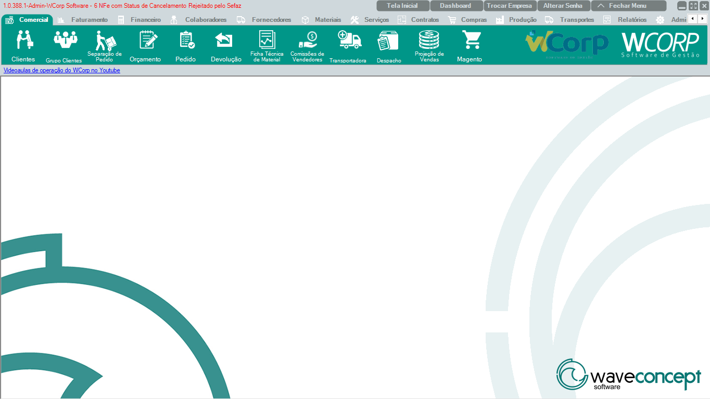

# Comercial

A aba **Comercial** concentra as rotinas ligadas a clientes, pedidos, orçamento, separação, devolução, comissão e apoio ao fluxo de venda.

A documentação desta seção deve seguir a mesma ordem dos botões exibidos no ERP, para que o usuário encontre no guia o mesmo caminho visual que vê na tela.

## Ordem da aba Comercial

| Ordem | Rotina | Página |
| --- | --- | --- |
| 1 | Clientes | [Acessar](comercial-clientes.md) |
| 2 | Grupo Clientes | [Acessar](comercial-grupo-clientes.md) |
| 3 | Separação de Pedido | [Acessar](comercial-separacao-pedido.md) |
| 4 | Orçamento | [Acessar](comercial-orcamento.md) |
| 5 | Pedido | [Acessar](pedidos.md) |
| 6 | Devolução | [Acessar](devolucao.md) |
| 7 | Ficha Técnica de Material | [Acessar](ficha-tecnica-material.md) |
| 8 | Comissões de Vendedores | [Acessar](comissoes-vendedores.md) |
| 9 | Transportadora | [Acessar](transportadora.md) |
| 10 | Despacho | [Acessar](despacho.md) |
| 11 | Projeção de Vendas | [Acessar](projecao-vendas.md) |
| 12 | Importar NFe para Remessa | [Acessar](importar-nfe-remessa.md) |

## Como preencher cada rotina

Cada página deve explicar:

- Para que a rotina serve.
- Quando o usuário deve usar.
- Qual caminho seguir no ERP.
- Quais campos precisam de atenção.
- Qual resultado esperado.
- Quais erros ou dúvidas chegam ao Suporte.

!!! tip "Para Suporte"
    Quando uma rotina gerar chamado frequente, inclua no final da página uma seção chamada **Orientação para Suporte** com critérios de triagem, dados necessários e erros conhecidos.
