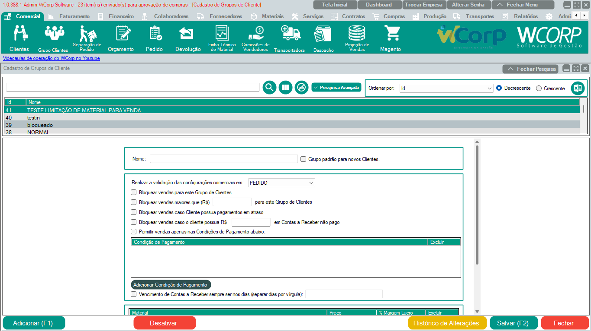

# Módulo Comercial - Cadastro de Grupo de Cliente

Para cadastrar um grupo de cliente é  necessário preencher o nome. O restante das opções ficam a critério da decisão e do funcionamento da empresa do usuário.

!!! info "Importante"
    O cadastro deve ser feito pelo usuário.

