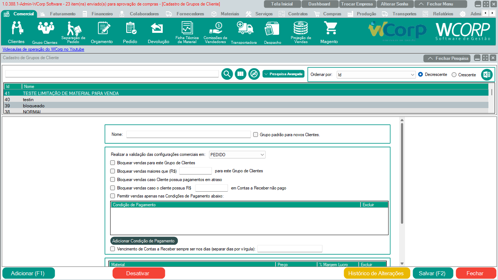

# Grupo de Clientes

## Objetivo

Cadastrar grupos de clientes para organização e classificação comercial.

## Caminho

`Comercial > Grupo de clientes`.

## Print da tela

## Quando usar

<!-- TODO: adicionar Quando usar -->

## Como usar

### Campos principais

Para cadastrar um grupo de cliente é necessário preencher o nome. O restante das opções ficam a critério da decisão e do funcionamento da empresa do usuário.

### Ações disponíveis

<!-- TODO: adicionar Ações disponíveis -->

## Avisos

!!! info "Cadastro"
    O cadastro deve ser feito pelo usuário.

## Dúvidas frequentes

<!-- TODO: adicionar Dúvidas frequentes -->

## Veja também

<!-- TODO: adicionar Veja também -->
