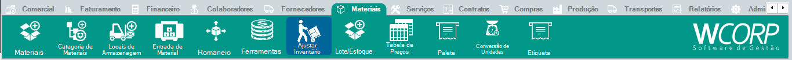

# Como ajustar inventário

## Pré-requisitos

- Estoque consultado
- Material cadastrado
- Motivo do ajuste definido

## Permissões

--8<-- "shared/avisos/permissoes.md"

## Caminho

`Materiais > Ajustar Inventário`.

## Demonstração em vídeo

[Demonstração do ajuste de inventário](../assets/videos/guias/ajustar-estoque/ajuste-inventario.mp4){ .wc-video-link }

## Como fazer

1. Acesse **Materiais > Ajustar Inventário**.
2. Localize o material que precisa de ajuste.
3. Informe local, lote e quantidade correta.
4. Informe o motivo do ajuste.
5. Revise o impacto no saldo.
6. Salve o ajuste.

