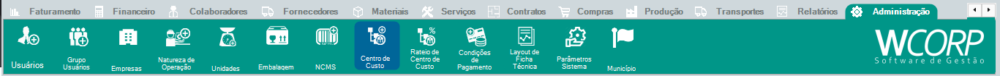

# Como cadastrar um Centro de Custo

## Pré-requisitos

- Nome e código do centro de custo definidos
- Definir se possui nó pai ou se é um centro de custo raiz
- Tipo do Centro de Custo definido

## Permissões

--8<-- "shared/avisos/permissoes.md"

## Caminho

`Administração > Centro de Custo`.

## Demonstração em vídeo

[Demonstração do cadastro de centro de custo](../assets/videos/adm_centro_custo.mp4){ .wc-video-link }

## Como fazer

1. Acesse **Administração > Centro de Custo**.
2. Inicie um novo cadastro.
3. Preencha os campos obrigatórios de identificação.
4. Confira as informações informadas.
5. Salve o centro de custo.
6. Valide se o cadastro está disponível na rotina em que será utilizado.

## Veja também

- [Consultar manual de centro de custo](../administracao/centro-custo.md){: target="_blank" rel="noopener" }