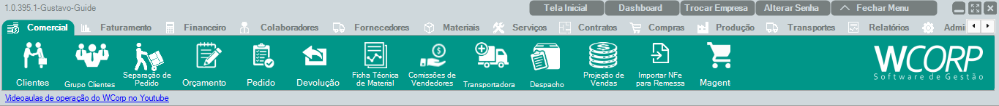

# Como cadastrar um cliente

## Pré-requisitos

- CNPJ, CPF ou dados cadastrais do cliente em mãos

## Permissões

--8<-- "shared/avisos/permissoes.md"

## Caminho
`Comercial > Clientes`.

## Print do caminho

## Demonstração em vídeo
<video class="wc-video" controls preload="auto" playsinline poster="../../assets/images/guias/comercial_clientes.png">
  <source src="../../assets/videos/comercial_clientes.mp4" type="video/mp4">
  Seu navegador não conseguiu reproduzir este vídeo.
</video>

## Como fazer

1. Acesse **Comercial > Clientes**.
2. Inicie um novo cadastro.
3. Informe o **CNPJ** e use a lupa para buscar os dados automaticamente.
4. Confira os dados retornados.
5. Complete os campos obrigatórios que faltarem.
6. Salve o cadastro.

**Resultado esperado**

O cliente fica salvo e disponível para seleção em pedidos, faturamento, financeiro e consultas.

## Quando utilizar

Use quando um cliente ainda não existir no WCorp ou quando for necessário completar os dados cadastrais antes de vender ou faturar.

## Veja também

- [Consultar CNPJ](../referencia/links-uteis.md){: target="_blank" rel="noopener" }
- [Como gerar um pedido](fazer-pedido-venda.md){: target="_blank" rel="noopener" }
- [Como emitir uma NF-e](faturar-nota.md){: target="_blank" rel="noopener" }
- [Consultar manual de clientes](../comercial/comercial-clientes.md){: target="_blank" rel="noopener" }
