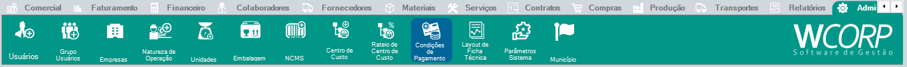

# Como cadastrar uma Condição de Pagamento

## Pré-requisitos

- Forma de pagamento
- Número de parcelas definido
- Prazo de pagamento por parcela definido

## Permissões

--8<-- "shared/avisos/permissoes.md"

## Caminho

`Administração > Condições de Pagamento`.

## Demonstração em vídeo

[Demonstração do cadastro de condição de pagamento](../assets/videos/adm_condicao_pagamento.mp4){ .wc-video-link }

## Como fazer

1. Acesse **Administração > Condições de Pagamento**.
2. Inicie um novo cadastro.
3. Preencha os campos obrigatórios conforme a condição utilizada pela empresa.
4. Revise as informações cadastradas.
5. Salve a condição de pagamento.

## Veja também

- [Consultar manual de condições de pagamento](../administracao/condicoes-pagamento.md){: target="_blank" rel="noopener" }