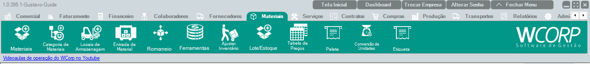

# Como cadastrar um material

## Pré-requisitos

!!! prerequisite "Antes de começar"
    - Tenha a descrição, a unidade, a categoria e os dados fiscais ou comerciais do material.

## Permissões

--8<-- "shared/avisos/permissoes.md"

## Caminho
`Materiais > Materiais`.

## Print do caminho

## Como fazer

1. Acesse **Materiais > Materiais**.
2. Inicie um novo cadastro.
3. Preencha descrição, categoria e unidade.
4. Informe dados fiscais, comerciais e de estoque quando aplicável.
5. Revise os campos obrigatórios.
6. Salve o cadastro.

**Resultado esperado**

O material fica salvo e disponível para uso nas movimentações compatíveis com seu cadastro.

## Demonstração em vídeo
<video class="wc-video" controls preload="auto" playsinline poster="../../assets/images/guias/materiais_materiais.png">
  <source src="../../assets/videos/materiais_materiais.mp4" type="video/mp4">
  Seu navegador não conseguiu reproduzir este vídeo.
</video>

## Quando utilizar

Use quando um produto, insumo, peça ou serviço controlado como material ainda não existir no WCorp.

## Veja também

- [Como ajustar estoque](ajustar-estoque.md){: target="_blank" rel="noopener" }
- [Como emitir uma NF-e](faturar-nota.md){: target="_blank" rel="noopener" }
- [Manual > Materiais > Materiais](../materiais/materiais.md){: target="_blank" rel="noopener" }
