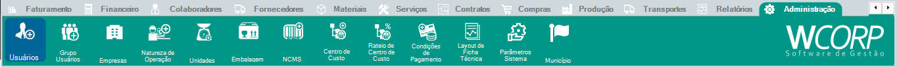

# Como cadastrar um usuário

## Pré-requisitos

- Usuário administrador ou autorização do responsável da empresa

## Permissões

--8<-- "shared/avisos/permissoes.md"

## Caminho

`Administração > Usuários`.

## Demonstração em vídeo

[Demonstração do cadastro de usuário](../assets/videos/adm_cadastro_usuario.mp4){ .wc-video-link }

## Como fazer

1. Acesse **Administração > Usuários**.
2. Inicie um novo cadastro.
3. Informe **Nome**, **Login**, **Senha** e **Grupo de Usuário**.
4. Preencha os demais vínculos necessários, quando aplicável.
5. Revise as informações e salve o usuário.
6. Valide o acesso com o grupo e as permissões definidas.

## Avisos

!!! info "Acesso do usuário"
    O Grupo de Usuário e suas permissões influenciam quais telas e operações estarão disponíveis para o novo usuário.

## Veja também

- [Como configurar um Grupo de Usuário](configurar-grupo-usuario.md){: target="_blank" rel="noopener" }
- [Consultar manual de usuários](../administracao/usuarios.md){: target="_blank" rel="noopener" }
