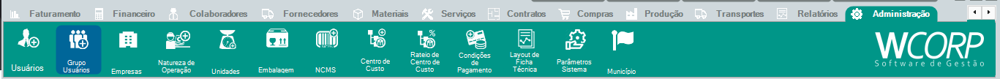

# Como configurar um Grupo de Usuário

## Pré-requisitos

- Usuário autorizado a administrar acessos

## Permissões

--8<-- "shared/avisos/permissoes.md"

## Caminho

`Administração > Grupo Usuários`.

## Demonstração em vídeo

[Demonstração da configuração de grupo de usuário](../assets/videos/adm__grupo_usuario.mp4){ .wc-video-link }

## Como fazer

1. Acesse **Administração > Grupo Usuários**.
2. Inicie um novo cadastro ou abra o grupo que será revisado.
3. Identifique o grupo de forma clara.
4. Configure as permissões necessárias conforme a orientação do responsável da empresa.
5. Revise e salve as alterações.
6. Valide o acesso com um usuário vinculado ao grupo.

## Avisos

!!! caution "Configuração de permissões"
    Conceda somente as permissões necessárias para as atividades dos usuários vinculados ao grupo.

## Veja também

- [Como cadastrar um usuário](cadastrar-usuario.md){: target="_blank" rel="noopener" }
- [Consultar manual de grupo usuários](../administracao/grupo-usuarios.md){: target="_blank" rel="noopener" }
