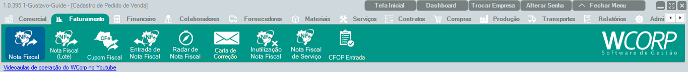

# Como consultar notas fiscais rejeitadas

## Pré-requisitos

- NFe já transmitida para a SEFAZ
- Retorno de rejeição disponível para consulta

## Permissões

--8<-- "shared/avisos/permissoes.md"

## Caminho

`Faturamento > Nota Fiscal`.

## Demonstração em vídeo

[Demonstração da consulta de NF-e rejeitada](../assets/videos/guias/consultar-nfe-rejeitada/consultar-nfe-rejeitada.mp4){ .wc-video-link }

## Como fazer

1. Acesse **Faturamento > Nota Fiscal**.
2. Localize a NF-e que retornou rejeição.
3. Abra a nota para consultar o retorno.
4. Leia a mensagem retornada pela SEFAZ.
5. Corrija a origem da rejeição conforme a mensagem apresentada.
6. Transmita novamente quando a correção estiver concluída.

## Avisos

--8<-- "shared/avisos/validacao-fiscal.md"

