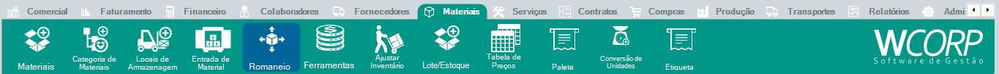

# Como criar romaneio

## Pré-requisitos

- Processo ou materiais que serão agrupados no romaneio definidos

## Permissões

--8<-- "shared/avisos/permissoes.md"

## Caminho

`Materiais > Romaneio`.

## Demonstração em vídeo

[Demonstração de romaneio](../assets/videos/guias/criar-romaneio/romaneio.mp4){ .wc-video-link }

## Como fazer

1. Acesse **Materiais > Romaneio**.
2. Inicie ou localize o romaneio que será trabalhado.
3. Informe os dados necessários conforme o processo.
4. Revise as informações antes de salvar.
5. Finalize a rotina conforme a ação disponível.

**Resultado esperado**

O romaneio fica registrado para apoiar o processo correspondente.
