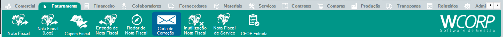

# Como emitir uma carta de correção

## Pré-requisitos

- NF-e autorizada e localizada
- Texto de correção validado

## Permissões

--8<-- "shared/avisos/permissoes.md"

## Caminho

`Faturamento > Carta de Correção`.

## Demonstração em vídeo

[Demonstração da emissão de carta de correção](../assets/videos/faturamento_carta_correcao.mp4){ .wc-video-link }

## Como fazer

1. Acesse **Faturamento > Carta de Correção**.
2. Localize a NF-e.
3. Inicie uma nova carta de correção.
4. Informe o texto da correção.
5. Revise o conteúdo.
6. Envie o evento.
7. Confira o retorno da SEFAZ.

## Avisos

--8<-- "shared/avisos/validacao-fiscal.md"

## Veja também

- [Como emitir uma NF-e](faturar-nota.md){: target="_blank" rel="noopener" }
- [Como cancelar uma NF-e](cancelar-nfe.md){: target="_blank" rel="noopener" }
- [Consultar manual de carta de correção](../faturamento/carta-correcao.md){: target="_blank" rel="noopener" }
