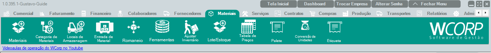

# Como verificar o empenho de material

## Pré-requisitos

- Material cadastrado
- Processo que utilizará o material definido
- Saldo disponível conferido

## Permissões

--8<-- "shared/avisos/permissoes.md"

## Caminho

`Materiais > Materiais`.

## Demonstração em vídeo

[Demonstração do empenho de material](../assets/videos/guias/empenhar-material/empenho-material.mp4){ .wc-video-link }

## Como fazer

1. Acesse a rotina em que o empenho do material será realizado.
2. Localize o material envolvido no processo.
3. Confira as informações de quantidade e saldo.
4. Registre ou confirme o empenho conforme a rotina apresentada.
5. Revise o resultado antes de finalizar.
