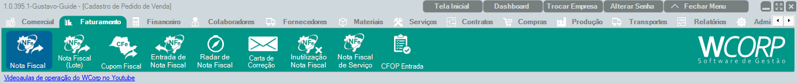

# Como emitir uma NF-e

## Pré-requisitos

- Cliente cadastrado. 
  [Como cadastrar um cliente](cadastrar-cliente.md){: target="_blank" rel="noopener" }.
- Material cadastrado. 
  [Como cadastrar um material](cadastrar-material.md){: target="_blank" rel="noopener" }.
- Natureza de operação cadastrada. 
  [Como cadastrar uma natureza de operação](cadastrar-natureza-operacao.md){: target="_blank" rel="noopener" }.
- Pedido criado, quando a emissão for por pedido. 
  [Como gerar um pedido](fazer-pedido-venda.md){: target="_blank" rel="noopener" }.
- Certificado e parâmetros fiscais configurados.

--8<-- "shared/avisos/validacao-fiscal.md"

--8<-- "shared/avisos/permissoes.md"

## Onde encontrar

Caminho: `Faturamento > Nota Fiscal`.

## Como fazer

1. Acesse **Faturamento > Nota Fiscal**.
2. Escolha emissão manual ou por pedido.
3. Se for por pedido, adicione o pedido correspondente.
4. Confira cliente, itens, valores e impostos.
5. Salve a nota.
6. Clique em **Transmitir**.
7. Confira o retorno da SEFAZ.

## Demonstração em vídeo

<video class="wc-video" controls preload="auto" playsinline>
  <source src="../../assets/videos/faturamento_nfe.mp4" type="video/mp4">
  Seu navegador não conseguiu reproduzir este vídeo.
</video>

## Erros comuns

Caso encontre algum dos erros abaixo, clique para visualizar a causa e como resolver.

- Cliente não encontrado — **Pendente**
- Material sem informação fiscal — **Pendente**
- Natureza incorreta ou ausente — **Pendente**
- Não é possível finalizar o cálculo automático — **Pendente**
- Falha de Schema — **Pendente**
- Rejeição 651 - Consumo Indevido — **Pendente**

## Quando utilizar

Use quando for necessário documentar fiscalmente uma venda, remessa ou outra operação de saída.

## Veja também

- [Como cancelar uma NF-e](cancelar-nfe.md){: target="_blank" rel="noopener" }
- [Como emitir uma devolução](emitir-devolucao.md){: target="_blank" rel="noopener" }
- [Como emitir uma carta de correção](emitir-carta-correcao.md){: target="_blank" rel="noopener" }
- [Manual > Faturamento > Nota Fiscal](../faturamento/faturamento-nf.md){: target="_blank" rel="noopener" }
