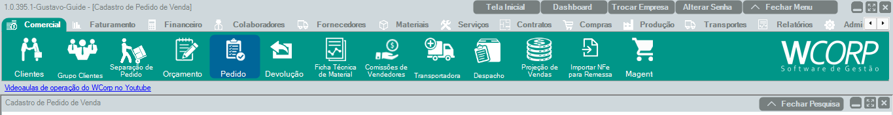

# Como gerar um pedido

## Pré-requisitos

- Cliente cadastrado 
  [Como cadastrar um cliente.](cadastrar-cliente.md){: target="_blank" rel="noopener" }
- Material cadastrado 
  [Como cadastrar um material.](cadastrar-material.md){: target="_blank" rel="noopener" }
- Condição de pagamento cadastrada no WCorp 
  [Como cadastrar uma condição de pagamento.](cadastrar-condicao-pagamento.md){: target="_blank" rel="noopener" }

## Permissões

--8<-- "shared/avisos/permissoes.md"

## Caminho
`Comercial > Pedido`.

## Print do caminho

## Demonstração em vídeo
<video class="wc-video" controls preload="auto" playsinline poster="../../assets/images/guias/comercial_pedido.png">
  <source src="../../assets/videos/comercial_pedido.mp4" type="video/mp4">
  Seu navegador não conseguiu reproduzir este vídeo.
</video>

## Como fazer

1. Acesse **Comercial > Pedido**.
2. Crie um novo pedido.
3. Informe o cliente.
4. Adicione os materiais e quantidades.
5. Confira valores, condição de pagamento e observações.
6. Salve o pedido.

## Outra opção

**Criar pedido a partir de um orçamento**

Caso já exista um orçamento aprovado, é possível gerar um pedido diretamente a partir dele, sem a necessidade de realizar um novo cadastro.

## Demonstração em vídeo
<video class="wc-video" controls preload="auto" playsinline>
  <source src="../../assets/videos/comercial_pedido_orcamento.mp4" type="video/mp4">
  Seu navegador não conseguiu reproduzir este vídeo.
</video>

## Quando utilizar

Use quando uma venda foi confirmada ou quando a empresa precisa registrar itens, quantidades, preços e condição de pagamento antes do faturamento.

## Veja também

- [Como criar um orçamento](criar-orcamento.md){: target="_blank" rel="noopener" }
- [Como cancelar um pedido](cancelar-pedido.md){: target="_blank" rel="noopener" }
- [Como emitir uma NF-e](faturar-nota.md){: target="_blank" rel="noopener" }
