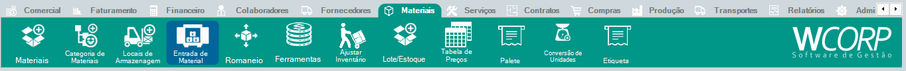

# Como realizar entrada de material

## Pré-requisitos

- Material cadastrado
- Documento ou informação de origem da entrada disponível

## Permissões

--8<-- "shared/avisos/permissoes.md"

## Caminho

`Materiais > Entrada de Material`.

## Demonstração em vídeo

[Demonstração de entrada de material](../assets/videos/guias/registrar-entrada-material/entrada-material.mp4){ .wc-video-link }

## Como fazer

1. Acesse **Materiais > Entrada de Material**.
2. Inicie ou localize o registro de entrada.
3. Informe os dados necessários da entrada.
4. Confira materiais, quantidades e demais informações exibidas.
5. Salve ou finalize a rotina conforme a ação disponível.

**Resultado esperado**

A entrada de material fica registrada para movimentar ou documentar o estoque.
