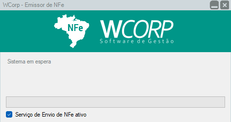

# Como utilizar emissor de NF-e

## Pré-requisitos

- Documento fiscal gerado ou em processo de envio
- Acesso ao Emissor liberado

## Permissões

--8<-- "shared/avisos/permissoes.md"

## Abrir o Emissor

[Demonstração de abertura do Emissor](../assets/videos/guias/usar-emissor/abrir-emissor.mp4){ .wc-video-link }

## Aguarde o processamento

## Verificar erro no Emissor

[Demonstração da verificação de erro no Emissor](../assets/videos/guias/usar-emissor/verificar-erro-emissor.mp4){ .wc-video-link data-poster="../assets/images/guias/usar-emissor/aguardar-emissor.png" }

## Como fazer

1. Abra o Emissor a partir da rotina fiscal utilizada.
2. Aguarde o processamento do envio ou consulta.
3. Verifique se há mensagem de erro ou retorno pendente.
4. Use a mensagem exibida como referência para corrigir o documento ou acionar o suporte.

## Avisos

--8<-- "shared/avisos/validacao-fiscal.md"

**Resultado esperado**

O retorno do Emissor fica visível para análise e correção quando necessário.
