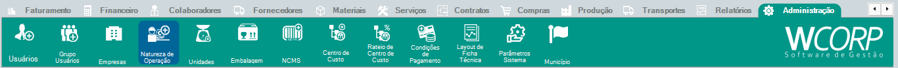

# Como verificar CBenef

## Pré-requisitos

- Nota fiscal ou regra fiscal a ser conferida
- CST e benefício fiscal validados com o responsável fiscal

## Permissões

--8<-- "shared/avisos/permissoes.md"

## Caminho

`Administração > Natureza de Operação`.

## Demonstração em vídeo

[Demonstração da verificação de CBenef](../assets/videos/guias/verificar-cbenef/verificar-cbenef.mp4){ .wc-video-link }

## Como fazer

1. Identifique a nota ou operação que precisa de conferência fiscal.
2. Localize a regra fiscal ou cadastro relacionado.
3. Verifique o código de benefício fiscal informado.
4. Confira se o CST e o CBenef utilizados estão coerentes.
5. Ajuste somente após validação com o responsável fiscal.

## Avisos

--8<-- "shared/avisos/validacao-fiscal.md"

**Resultado esperado**

O CBenef fica conferido antes de nova emissão ou transmissão.
