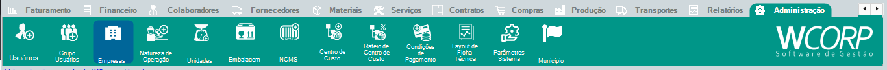

# Como verificar usuários logados

## Pré-requisitos

- Acesso administrativo liberado
- Usuário ou evento que será consultado definido

## Permissões

--8<-- "shared/avisos/permissoes.md"

## Caminho

`Administração > Usuários`.

## Demonstração em vídeo

[Demonstração da consulta de usuários e log](../assets/videos/guias/verificar-usuarios-log/verificar-usuarios-log.mp4){ .wc-video-link }

## Como fazer

1. Acesse Administração > Empresas.
2. Visualize os usuários que estão logados.
3. Consulte as informações exibidas.
4. Use o resultado para análise administrativa ou suporte.

