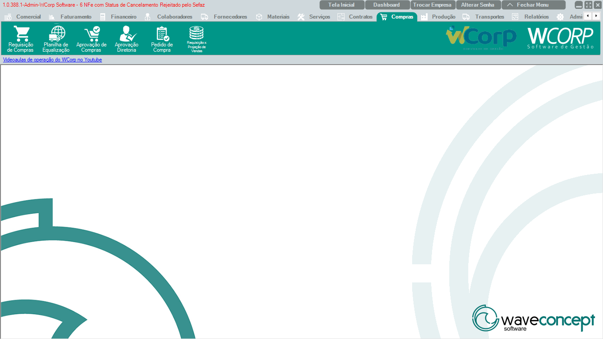

# Compras

A aba **Compras** reúne requisições, equalização, aprovações, pedidos de compra e vínculos com projeção de vendas.

A documentação desta seção segue a mesma ordem dos botões exibidos no ERP.

## Ordem da aba Compras

| Ordem | Rotina | Página |
| --- | --- | --- |
| 1 | Requisição de Compras | [Acessar](requisicao-compras.md) |
| 2 | Planilha de Equalização | [Acessar](planilha-equalizacao.md) |
| 3 | Aprovação de Compras | [Acessar](aprovacao-compras.md) |
| 4 | Aprovação Diretoria | [Acessar](aprovacao-diretoria.md) |
| 5 | Pedido de Compra | [Acessar](pedido-compra.md) |
| 6 | Requisições x Projeção de Vendas | [Acessar](requisicoes-projecao-vendas.md) |

## Antes de operar rotinas de Compras

- Confira solicitante, itens, quantidades e fornecedor.`r`n- Em aprovações, valide status, alçada e observações.`r`n- Em pedido de compra, confira condições comerciais antes de finalizar.

??? info "Ver mais para Suporte"

    ## Orientação para Suporte

    Em atendimentos de Compras, colete número da requisição ou pedido, solicitante, fornecedor, status, mensagem completa e print da tela.
