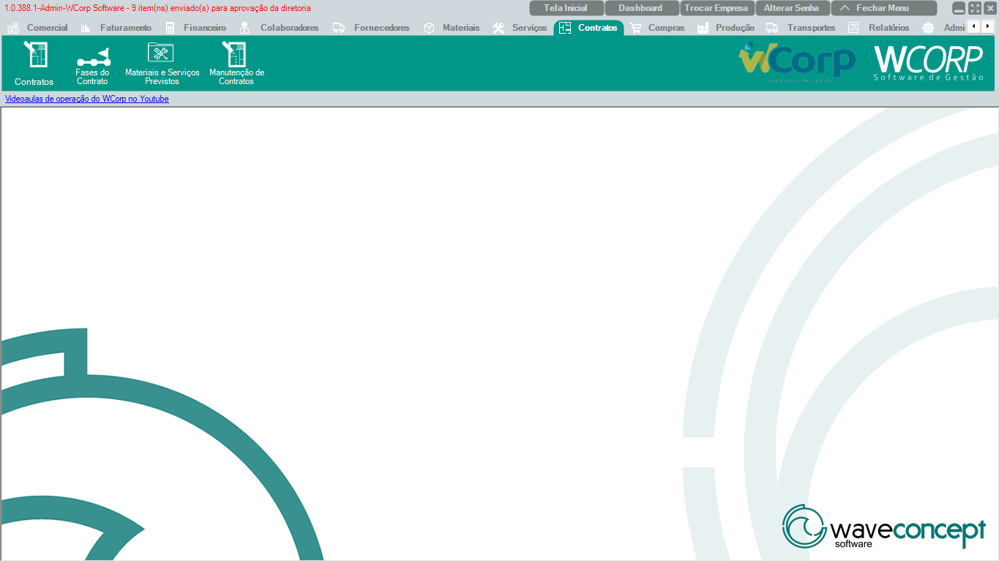

# Contratos

A aba **Contratos** reúne cadastros e manutenções ligados a contratos, fases e materiais ou serviços previstos.

A documentação desta seção segue a mesma ordem dos botões exibidos no WCorp.

## Ordem da aba Contratos

| Ordem | Rotina | Página |
| --- | --- | --- |
| 1 | Contratos | [Acessar](contratos.md) |
| 2 | Fases do Contrato | [Acessar](fases-contrato.md) |
| 3 | Materiais e Serviços Previstos | [Acessar](materiais-servicos-previstos.md) |
| 4 | Manutenção de Contratos | [Acessar](manutencao-contratos.md) |

## Antes de operar rotinas de Contratos

- Confira cliente, vigência, fase e itens previstos antes de salvar.`r`n- Em manutenção, valide status do contrato e histórico de alterações.

??? info "Ver mais para Suporte"

    ## Orientação para Suporte

    Em atendimentos de Contratos, colete número do contrato, cliente, fase, mensagem completa e print da tela.
