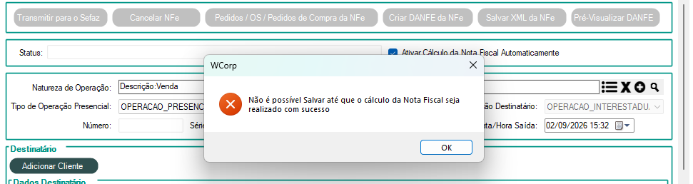

# Cálculo da Nota Fiscal não realizado com sucesso

## Mensagem apresentada

Ao tentar salvar a NF-e, o sistema apresenta:

> Não é possível Salvar até que o cálculo da Nota Fiscal seja realizado com sucesso

<figure class="wc-operational-error-print">
  
  <figcaption>Mensagem apresentada no WCorp</figcaption>
</figure>

## Por que ocorre

O cálculo da nota não foi feito corretamente.

## Onde verificar

Verifique se existe alguma regra fiscal cadastrada com os filtros dessa nota, por exemplo:

- Estado;
- Indicador de IE;
- Categoria;
- NCM;
- material.

## Como corrigir

Edite ou crie uma regra fiscal com os filtros necessários para a nota. Depois disso, será possível salvar a Nota Fiscal.

