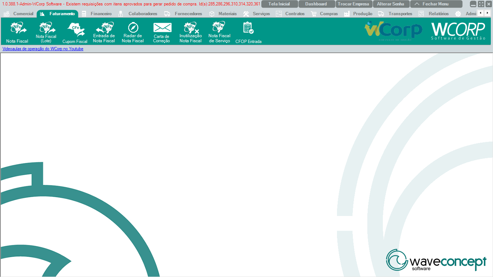

# Faturamento

A aba **Faturamento** reúne as rotinas fiscais do WCorp, incluindo emissão de nota fiscal, cupom fiscal, entrada de notas, carta de correção, inutilização e configurações de entrada.

A documentação desta seção segue a mesma ordem dos botões exibidos no WCorp, para facilitar a localização pelo usuário.

## Ordem da aba Faturamento

| Ordem | Rotina | Página |
| --- | --- | --- |
| 1 | Nota Fiscal | [Acessar](faturamento-nf.md) |
| 2 | Nota Fiscal (Lote) | [Acessar](nota-fiscal-lote.md) |
| 3 | Cupom Fiscal | [Acessar](faturamento-nfce.md) |
| 4 | Entrada de Nota Fiscal | [Acessar](entrada-nota-fiscal.md) |
| 5 | Radar de Nota Fiscal | [Acessar](radar-nota-fiscal.md) |
| 6 | Carta de Correção | [Acessar](carta-correcao.md) |
| 7 | Inutilização Nota Fiscal | [Acessar](inutilizacao-nota-fiscal.md) |
| 8 | Nota Fiscal de Serviço | [Acessar](nota-fiscal-servico.md) |
| 9 | CFOP Entrada | [Acessar](cfop-entrada.md) |

## Antes de operar rotinas fiscais

- Confira se o cadastro do cliente ou fornecedor está completo.
- Valide NCM, CFOP, natureza de operação e impostos quando aplicável.
- Verifique se o certificado digital e o ambiente fiscal estão funcionando.
- Em caso de rejeição, copie a mensagem completa antes de tentar novas alterações.

??? info "Ver mais para Suporte"

    ## Orientação para Suporte

    Em atendimentos de Faturamento, colete sempre:

    - Número da nota, pedido ou documento de origem.
    - Cliente ou fornecedor envolvido.
    - Natureza de operação, CFOP e tipo de documento.
    - Mensagem completa da SEFAZ ou do Sistema.
    - Print da tela e horário aproximado da tentativa.
    - Informação se o problema ocorre em uma nota específica ou em todas.
