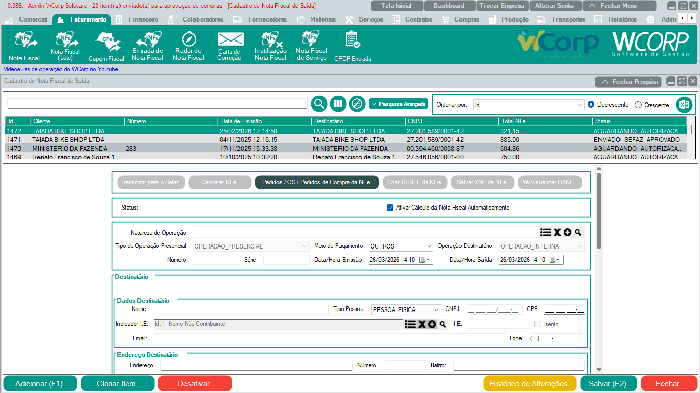
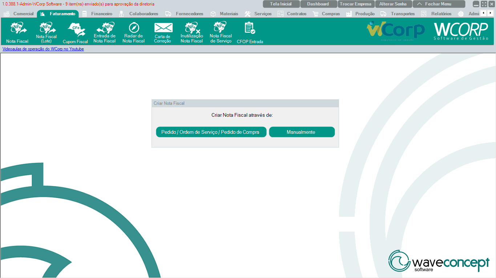
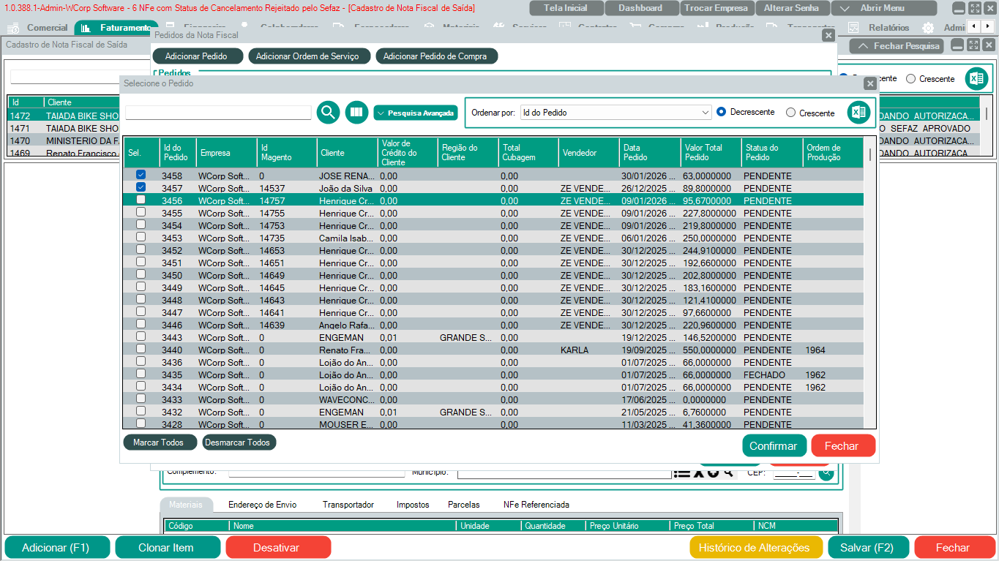
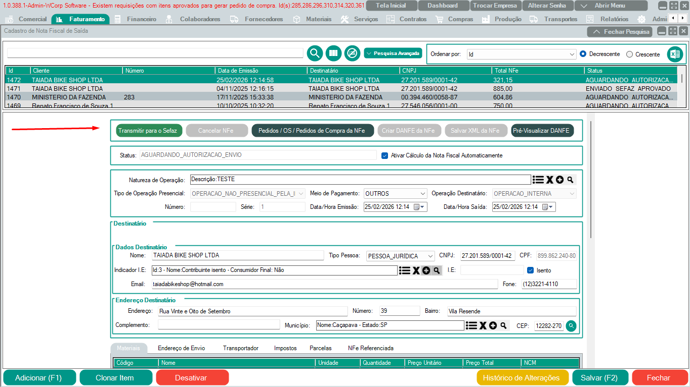

# Nota Fiscal

## Objetivo

Emitir nota fiscal de saída no WCorp, de forma manual ou vinculada a pedidos.

## Print da tela com caminho

`Faturamento > Nota Fiscal`

## Quando usar

Use esta rotina quando for necessário:

- Emitir uma nota fiscal de saída.
- Gerar nota a partir de um pedido.
- Cadastrar nota manualmente.
- Conferir impostos antes da transmissão.
- Transmitir a nota para a SEFAZ.

## Passo a passo

1. Acesse a aba **Faturamento**.
2. Clique em **Nota Fiscal**.
3. No cadastro de nota fiscal de saída, escolha se a emissão será **manual** ou **por pedido**.

4. Se a emissão for por pedido, clique em `Pedidos/OS/Pedidos de Compra da NFe`.
5. Clique em **Adicionar Pedido**.
6. Selecione o pedido referente à NFe.
7. Salve a seleção.

8. Confira os campos de imposto no material e na aba de impostos.
9. Caso falte algum campo obrigatório, o sistema informará ao tentar salvar.
10. Clique em **Transmitir** para enviar a nota à SEFAZ.

!!! info "Dica"
    Quando a nota é gerada por pedido, o sistema já busca os impostos automaticamente com base na regra fiscal configurada.

### Campos principais

| Campo | Descrição | Observações |
| --- | --- | --- |
| Pedido | Documento de origem usado para gerar a nota | Usado quando a emissão é por pedido |
| Cliente | Destinatário da nota | Deve estar com cadastro completo |
| Materiais | Itens vinculados à nota | Conferir quantidade, valor e impostos |
| Impostos | Aba com os dados fiscais da emissão | Revisar antes de transmitir |
| Transmitir | Envia a nota para autorização | Usar após conferir os dados obrigatórios |

## Dúvidas frequentes

| Dúvida | Orientação |
| --- | --- |
| Posso emitir nota manualmente? | Sim. A tela permite emissão manual ou por pedido. |
| Quando devo usar emissão por pedido? | Use quando a nota deve ser gerada a partir de um pedido já cadastrado. |
| O sistema informa se faltar algum campo? | Sim. Ao salvar ou transmitir, o Sistema indica campos obrigatórios pendentes. |
| Preciso conferir impostos se vier do pedido? | Sim. Mesmo com cálculo automático, confira material e aba de impostos antes de transmitir. |

## Veja também

- [Como emitir uma NF-e](../como-fazer/faturar-nota.md){: target="_blank" rel="noopener" }
- [Como cancelar uma NF-e](../como-fazer/cancelar-nfe.md){: target="_blank" rel="noopener" }
- [Como emitir uma carta de correção](../como-fazer/emitir-carta-correcao.md){: target="_blank" rel="noopener" }
