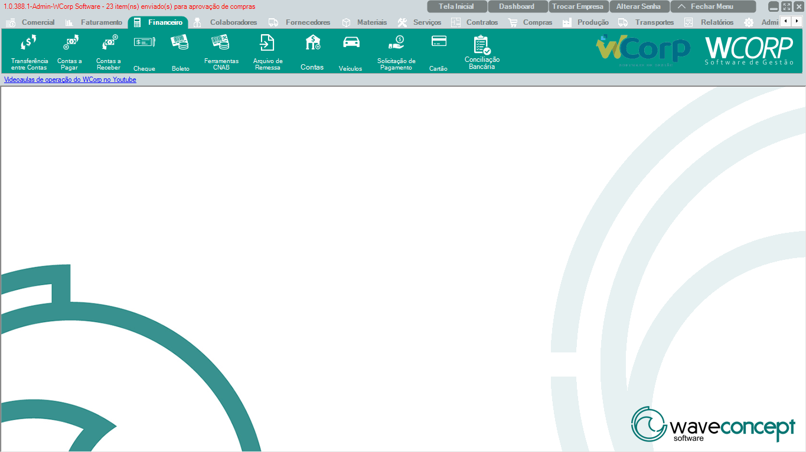

# Financeiro

A aba **Financeiro** reúne rotinas de contas a pagar, contas a receber, boletos, remessas, contas bancárias, cartões e conciliação bancária.

A documentação desta seção segue a mesma ordem dos botões exibidos no ERP.

## Ordem da aba Financeiro

| Ordem | Rotina | Página |
| --- | --- | --- |
| 1 | Transferência entre Contas | [Acessar](transferencia-entre-contas.md) |
| 2 | Contas a Pagar | [Acessar](contas-a-pagar.md) |
| 3 | Contas a Receber | [Acessar](contas-a-receber.md) |
| 4 | Cheque | [Acessar](cheque.md) |
| 5 | Boleto | [Acessar](boleto.md) |
| 6 | Ferramentas CNAB | [Acessar](ferramentas-cnab.md) |
| 7 | Arquivo de Remessa | [Acessar](arquivo-remessa.md) |
| 8 | Contas | [Acessar](contas.md) |
| 9 | Veículos | [Acessar](veiculos.md) |
| 10 | Solicitação de Pagamento | [Acessar](solicitacao-pagamento.md) |
| 11 | Cartão | [Acessar](cartao.md) |
| 12 | Conciliação Bancária | [Acessar](conciliacao-bancaria.md) |

## Antes de operar rotinas financeiras

- Confira empresa, conta, período e filtros utilizados.
- Valide cliente, fornecedor ou colaborador relacionado ao lançamento.
- Verifique vencimento, valor, forma de pagamento e status do título.
- Em integrações bancárias, preserve arquivos de remessa, retorno e mensagens exibidas.

??? info "Ver mais para Suporte"

    ## Orientação para Suporte

    Em atendimentos financeiros, colete sempre:

    - Empresa e usuário afetado.
    - Número do título, lançamento, boleto, remessa ou conta, quando houver.
    - Cliente, fornecedor, colaborador ou banco envolvido.
    - Valor, vencimento e status atual.
    - Print da tela e mensagem completa exibida.
    - Informação se o problema ocorre em um registro específico ou em todos.
