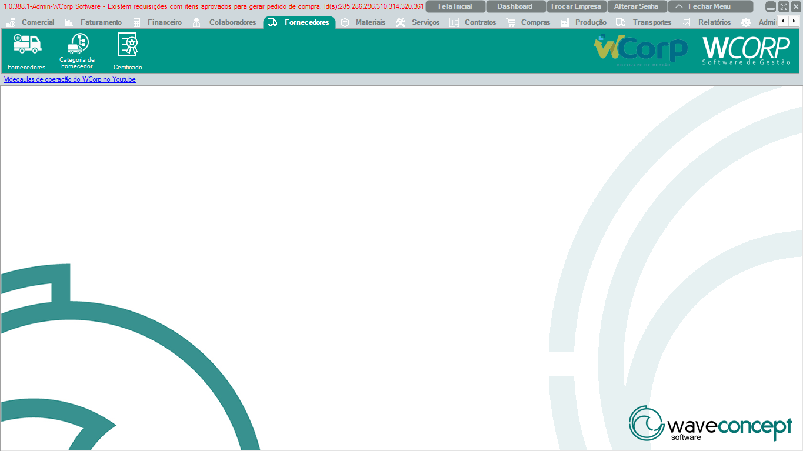

# Fornecedores

A aba **Fornecedores** reúne rotinas de cadastro de fornecedores, categorias e certificados utilizados em processos de compra, recebimento e controle fiscal.

A documentação desta seção segue a mesma ordem dos botões exibidos no WCorp.

## Ordem da aba Fornecedores

| Ordem | Rotina | Página |
| --- | --- | --- |
| 1 | Fornecedores | [Acessar](fornecedores.md) |
| 2 | Categoria de Fornecedor | [Acessar](categoria-fornecedor.md) |
| 3 | Certificado | [Acessar](certificado.md) |

## Antes de operar rotinas de Fornecedores

- Confira se o fornecedor já existe antes de criar um novo cadastro.`r`n- Valide documento, razão social, endereço e contatos.`r`n- Em processos fiscais, confira dados tributários e certificado quando aplicável.
