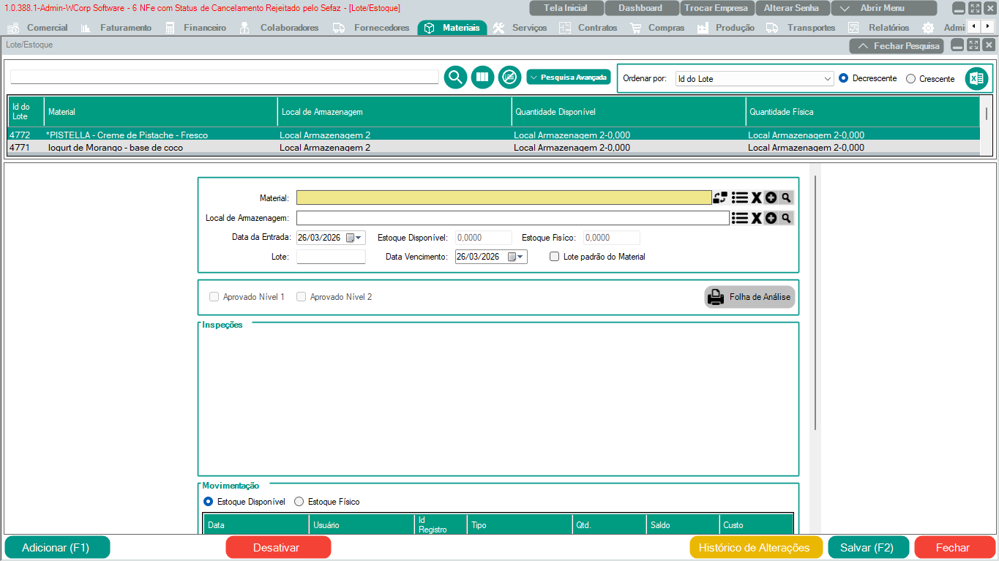

# Materiais - Lote/Estoque

Para cadastrar um Lote novo é necessário preencher as informações obrigatórias.
Primeiro selecionar o material, após isso selecionar o local de armazenagem e informar o nome do Lote.

Depois de configurado é possível selecionar o lote referente ao pedido, exemplo:

O pedido 150 com material SACOLA PLASTICA com código 25 utiliza o lote 111A //
O pedido 151 com material SACOLA PLASTICA com código 25 utiliza o lote 222B //

!!! info "Importante"
    Caso se tratar de um lote padrão, marcar a caixa 'Lote padrão do Material'
	

