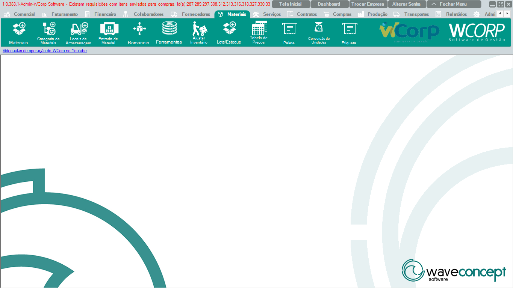

# Materiais

A aba **Materiais** reúne rotinas de cadastro, categorias, locais de armazenagem, entrada, romaneio, inventário, lote/estoque, preços, paletes, conversão de unidades e etiquetas.

A documentação desta seção segue a mesma ordem dos botões exibidos no WCorp.

## Ordem da aba Materiais

| Ordem | Rotina | Página |
| --- | --- | --- |
| 1 | Materiais | [Acessar](materiais.md) |
| 2 | Categoria de Materiais | [Acessar](categoria-materiais.md) |
| 3 | Locais de Armazenagem | [Acessar](locais-armazenagem.md) |
| 4 | Entrada de Material | [Acessar](entrada-material.md) |
| 5 | Romaneio | [Acessar](romaneio.md) |
| 6 | Ferramentas | [Acessar](ferramentas.md) |
| 7 | Ajustar Inventário | [Acessar](ajustar-inventario.md) |
| 8 | Lote/Estoque | [Acessar](lote-estoque.md) |
| 9 | Tabela de Preços | [Acessar](tabela-precos.md) |
| 10 | Palete | [Acessar](palete.md) |
| 11 | Conversão de Unidades | [Acessar](conversao-unidades.md) |
| 12 | Etiqueta | [Acessar](etiqueta.md) |

## Antes de operar rotinas de Materiais

- Confira se o material já existe antes de criar um novo cadastro.`r`n- Valide categoria, unidade, local de armazenagem e controle de lote quando aplicável.`r`n- Em movimentações, confira quantidade, origem, destino e tipo de operação.

??? info "Ver mais para Suporte"

    ## Orientação para Suporte

    Em atendimentos de Materiais, colete código ou descrição do material, local de armazenagem, lote, quantidade, operação, mensagem completa e print da tela.
