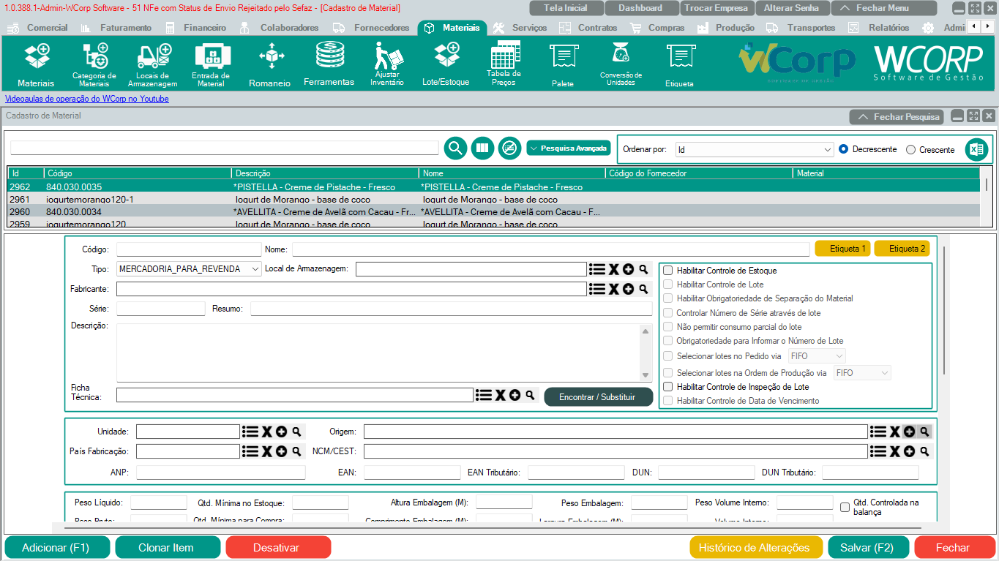

Materiais - Cadastro de Materiais

Para cadastrar o material é necessário preencher as informações obrigatórias tais como, Código, Nome, Tipo, Local de armazenagem, Descrição e etc.
As informações fiscais como Origem, NCM, ANP (se tiver) e afins deverão ser preenchidas conforme orientação da contabilidade.
O restante das opções não obrigatórias ficam a critério da decisão e do funcionamento da empresa do usuário.

!!! info "Dica Importante"
    Para habilitar o controle de estoque o material deve estar com estoque zerado e sem empenhos.
	

