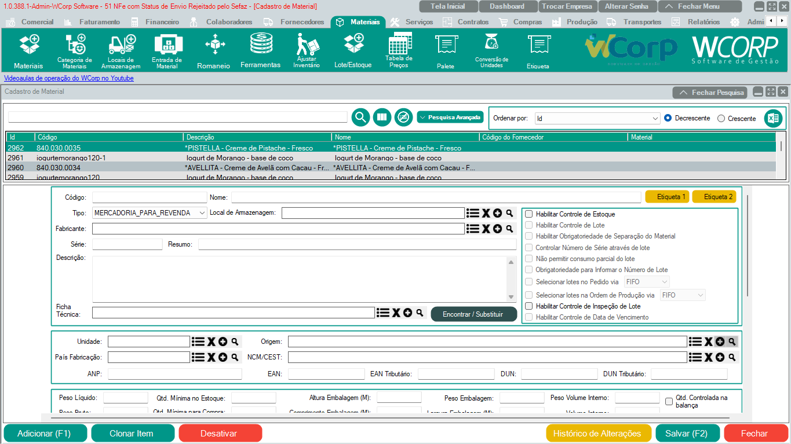

# Cadastro de Materiais

## Objetivo

Cadastrar e consultar materiais utilizados nas rotinas comerciais, fiscais e de estoque do WCorp.

## Quando usar

Use esta tela quando for necessário cadastrar, revisar ou completar informações de um material.

## Caminho

`Materiais > Materiais`.

## Print da tela

## Campos principais

Para cadastrar o material é necessário preencher as informações obrigatórias tais como, Código, Nome, Tipo, Local de armazenagem, Descrição e etc.
As informações fiscais como Origem, NCM, ANP (se tiver) e afins deverão ser preenchidas conforme orientação da contabilidade.
O restante das opções não obrigatórias ficam a critério da decisão e do funcionamento da empresa do usuário.

## Avisos

!!! info "Controle de estoque"
    Para habilitar o controle de estoque o material deve estar com estoque zerado e sem empenhos.
