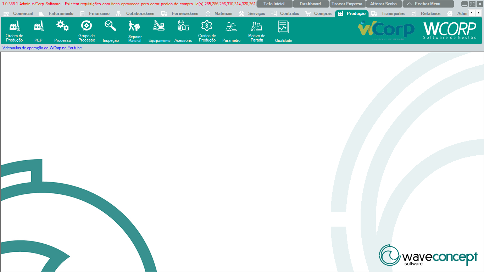

# Produção

A aba **Produção** reúne ordem de produção, PCP, processos, inspeção, separação de material, equipamentos, custos, parâmetros, paradas e qualidade.

A documentação desta seção segue a mesma ordem dos botões exibidos no WCorp.

## Ordem da aba Produção

| Ordem | Rotina | Página |
| --- | --- | --- |
| 1 | Ordem de Produção | [Acessar](ordem-producao.md) |
| 2 | PCP | [Acessar](pcp.md) |
| 3 | Processo | [Acessar](processo.md) |
| 4 | Grupo de Processo | [Acessar](grupo-processo.md) |
| 5 | Inspeção | [Acessar](inspecao.md) |
| 6 | Separar Material | [Acessar](separar-material.md) |
| 7 | Equipamento | [Acessar](equipamento.md) |
| 8 | Acessório | [Acessar](acessorio.md) |
| 9 | Custos de Produção | [Acessar](custos-producao.md) |
| 10 | Parâmetro | [Acessar](parametro.md) |
| 11 | Motivo de Parada | [Acessar](motivo-parada.md) |
| 12 | Qualidade | [Acessar](qualidade.md) |

## Antes de operar rotinas de Produção

- Confira ordem de produção, material, processo e quantidade.`r`n- Em apontamentos, valide etapa, recurso, equipamento e status.`r`n- Em qualidade, registre evidências e resultados da inspeção.
