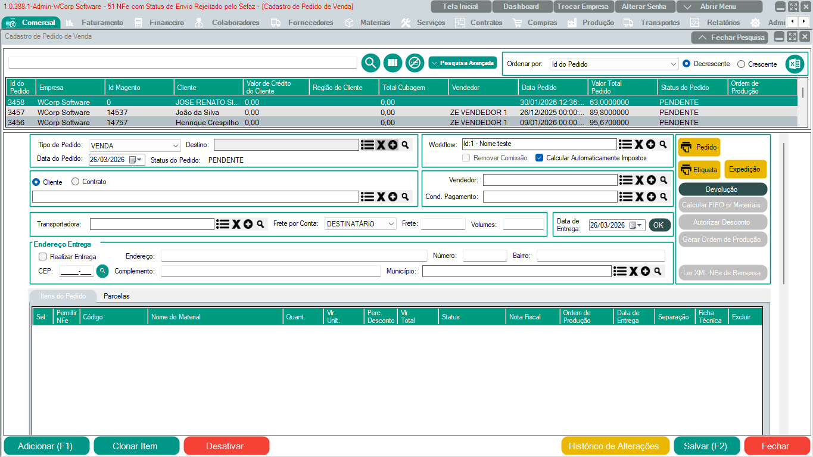

# Perguntas frequentes

## Como encontro uma rotina?

Use a busca no topo da documentação ou navegue pelo módulo correspondente.

## O que fazer quando uma regra não estiver documentada?

Registre a dúvida, valide com a área responsável e atualize a página relacionada depois da confirmação.

## Posso documentar com prints?

Sim. Salve imagens em `docs/assets/` e use um texto alternativo claro.

```markdown

```
