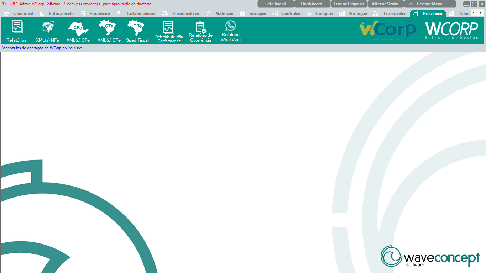

# Relatórios

A aba **Relatórios** reúne consultas, extrações fiscais, SPED, não conformidades, ocorrências e relatórios de WhatsApp.

A documentação desta seção segue a mesma ordem dos botões exibidos no WCorp.

## Ordem da aba Relatórios

| Ordem | Rotina | Página |
| --- | --- | --- |
| 1 | Relatórios | [Acessar](relatorios.md) |
| 2 | XML(s) NFe | [Acessar](xml-nfe.md) |
| 3 | XML(s) CFe | [Acessar](xml-cfe.md) |
| 4 | XML(s) CTe | [Acessar](xml-cte.md) |
| 5 | Sped Fiscal | [Acessar](sped-fiscal.md) |
| 6 | Relatório de Não Conformidade | [Acessar](relatorio-nao-conformidade.md) |
| 7 | Relatório de Ocorrência | [Acessar](relatorio-ocorrencia.md) |
| 8 | Relatório WhatsApp | [Acessar](relatorio-whatsapp.md) |

## Antes de operar rotinas de Relatórios

- Confira período, empresa e filtros antes de gerar.`r`n- Em XML e SPED, valide tipo de documento e competência.`r`n- Ao exportar, registre filtros usados para reproduzir o resultado.

??? info "Ver mais para Suporte"

    ## Orientação para Suporte

    Em atendimentos de Relatórios, colete nome do relatório, filtros usados, período, resultado esperado, print e arquivo exportado quando houver.
