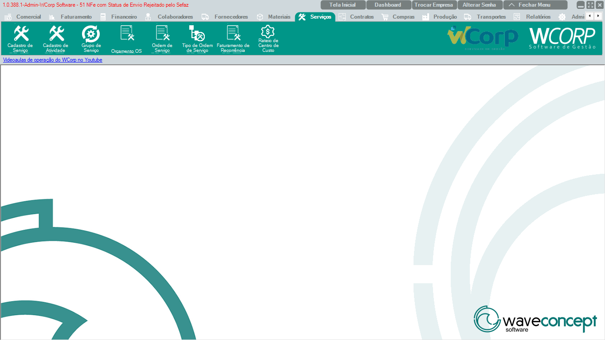

# Serviços

A aba **Serviços** reúne rotinas de cadastro de serviços, atividades, grupos, orçamentos, ordens de serviço e recorrência.

A documentação desta seção segue a mesma ordem dos botões exibidos no WCorp.

## Ordem da aba Serviços

| Ordem | Rotina | Página |
| --- | --- | --- |
| 1 | Cadastro de Serviço | [Acessar](cadastro-servico.md) |
| 2 | Cadastro de Atividade | [Acessar](cadastro-atividade.md) |
| 3 | Grupo de Serviço | [Acessar](grupo-servico.md) |
| 4 | Orçamento OS | [Acessar](orcamento-os.md) |
| 5 | Ordem de Serviço | [Acessar](ordem-servico.md) |
| 6 | Tipo de Ordem de Serviço | [Acessar](tipo-ordem-servico.md) |
| 7 | Faturamento de Recorrência | [Acessar](faturamento-recorrencia.md) |
| 8 | Rateio de Centro de Custo | [Acessar](rateio-centro-custo.md) |

## Antes de operar rotinas de Serviços

- Confira cliente, serviço, atividade e responsável antes de salvar.`r`n- Em ordens de serviço, valide status, prazo e informações de faturamento.`r`n- Em recorrência, confira período, centro de custo e regra de geração.

??? info "Ver mais para Suporte"

    ## Orientação para Suporte

    Em atendimentos de Serviços, colete número da OS ou orçamento, cliente, serviço, status, mensagem completa e print da tela.
