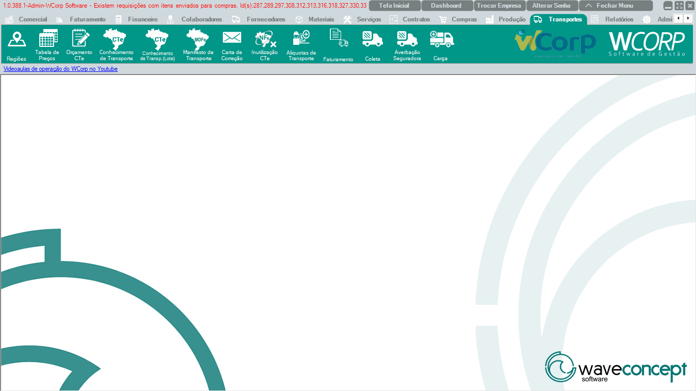

# Transportes

A aba **Transportes** reúne regiões, tabelas de preço, CT-e, MDF-e, carta de correção, inutilização, alíquotas, faturamento, coleta, averbação e carga.

A documentação desta seção segue a mesma ordem dos botões exibidos no WCorp.

## Ordem da aba Transportes

| Ordem | Rotina | Página |
| --- | --- | --- |
| 1 | Regiões | [Acessar](regioes.md) |
| 2 | Tabela de Preços | [Acessar](tabela-precos.md) |
| 3 | Orçamento CTe | [Acessar](orcamento-cte.md) |
| 4 | Conhecimento de Transporte | [Acessar](conhecimento-transporte.md) |
| 5 | Conhecimento de Transp.(Lote) | [Acessar](conhecimento-transporte-lote.md) |
| 6 | Manifesto de Transporte | [Acessar](manifesto-transporte.md) |
| 7 | Carta de Correção | [Acessar](carta-correcao.md) |
| 8 | Inutilização CTe | [Acessar](inutilizacao-cte.md) |
| 9 | Alíquotas de Transporte | [Acessar](aliquotas-transporte.md) |
| 10 | Faturamento | [Acessar](faturamento.md) |
| 11 | Coleta | [Acessar](coleta.md) |
| 12 | Averbação Seguradora | [Acessar](averbacao-seguradora.md) |
| 13 | Carga | [Acessar](carga.md) |

## Antes de operar rotinas de Transportes

- Confira região, transportadora, valores e documentos fiscais.`r`n- Em CT-e/MDF-e, preserve mensagens de retorno fiscal.`r`n- Em coletas e cargas, valide status e vínculo com documentos.

??? info "Ver mais para Suporte"

    ## Orientação para Suporte

    Em atendimentos de Transportes, colete número do CT-e/MDF-e/carga, transportadora, cliente, status, mensagem completa e print da tela.
